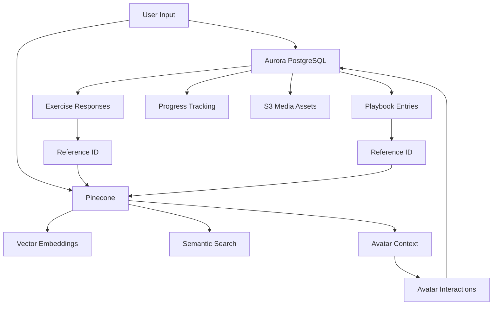

# Hybrid Architecture: Aurora PostgreSQL + Pinecone

## 🎯 **Architecture Overview**

The North Playbook uses a **hybrid data architecture** optimized for different use cases:

### **Aurora PostgreSQL** (Core Playbook Data)
- **✅ User profiles & authentication**
- **✅ Exercise responses & metadata** 
- **✅ Playbook entries & organization**
- **✅ Progress tracking & analytics**
- **✅ Media asset references (S3)**
- **✅ Relational data integrity**

### **Pinecone** (Avatar Knowledge Base)
- **✅ Vector embeddings for avatar context**
- **✅ Semantic search across knowledge**
- **✅ Fast similarity matching**
- **✅ Scalable vector operations**
- **✅ Avatar memory & personalization**

---

## 🏗️ **Data Flow**



---

## 📊 **Database Schema (Aurora PostgreSQL)**

### **Core Tables**
- `user_profiles` - User data & preferences
- `exercises` - Exercise definitions
- `exercise_responses` - User responses with metadata
- `playbook_entries` - Structured playbook content
- `media_assets` - S3 references for files
- `user_progress` - Detailed progress tracking
- `avatar_interactions` - Chat history & context

### **Key Features**
- **🔍 Full-text search** with PostgreSQL's `tsvector`
- **📈 Analytics views** for performance insights
- **🔄 Automatic triggers** for updated timestamps
- **💾 JSONB support** for flexible metadata
- **🎯 Optimized indexes** for fast queries

---

## 🧠 **Pinecone Integration**

### **Vector Storage**
- **User exercise responses** → Vector embeddings
- **Playbook entries** → Semantic search
- **Avatar context** → Personalized responses
- **Knowledge base** → Contextual recommendations

### **Cross-Reference System**
- Aurora PostgreSQL stores **`pinecone_id`** references
- Pinecone metadata includes **`postgres_id`** back-references
- Enables **bidirectional lookups** for full context

---

## 🚀 **Benefits of This Architecture**

### **Performance**
- **PostgreSQL** handles complex queries & analytics
- **Pinecone** provides millisecond vector search
- **S3** stores media with CDN optimization

### **Scalability**
- **Aurora Serverless v2** auto-scales compute
- **Pinecone** handles millions of vectors
- **Independent scaling** for different workloads

### **Cost Optimization**
- **PostgreSQL** for structured data (cost-effective)
- **Pinecone** only for vector operations (specialized)
- **S3** with intelligent tiering

### **Developer Experience**
- **Familiar SQL** for business logic
- **Simple vector API** for AI features
- **Type-safe interfaces** for both systems

---

## 🔧 **Environment Variables**

### **Aurora PostgreSQL**
```env
AURORA_POSTGRES_HOST=north-playbook-cluster.cluster-cpgem0mmuim3.us-west-2.rds.amazonaws.com
AURORA_POSTGRES_PORT=5432
AURORA_POSTGRES_DATABASE=north_playbook
AURORA_POSTGRES_USER=postgres
AURORA_POSTGRES_SECRET_ARN=arn:aws:secretsmanager:us-west-2:047719623558:secret:rds!cluster-cd6de05d-6ecd-4fe1-a75d-d8d4d625c567-AOGYnd
```

### **Pinecone**
```env
PINECONE_API_KEY=your-pinecone-api-key
PINECONE_ENVIRONMENT=your-pinecone-environment
PINECONE_INDEX_NAME=north-playbook-knowledge
```

---

## 📱 **Usage Examples**

### **Save Exercise Response**
```typescript
// Save to PostgreSQL
const response = await playbookService.saveExerciseResponse({
  exerciseId: 'exercise-123',
  userId: 'user-456',
  responseText: 'I am grateful for...',
  mood: 'positive',
  tags: ['gratitude', 'reflection']
});

// Create vector embedding for Pinecone
const embedding = await createEmbedding(response.responseText);
const pineconeId = await pineconeService.upsert({
  id: response.id,
  values: embedding,
  metadata: {
    userId: response.userId,
    exerciseId: response.exerciseId,
    content: response.responseText
  }
});

// Update PostgreSQL with Pinecone reference
await playbookService.updateExerciseResponse(response.id, {
  pineconeId: pineconeId
});
```

### **Avatar Query with Context**
```typescript
// Search Pinecone for relevant context
const contextResults = await pineconeService.query({
  vector: await createEmbedding(userMessage),
  filter: { userId: 'user-456' },
  topK: 5
});

// Get full context from PostgreSQL
const fullContext = await Promise.all(
  contextResults.matches.map(match => 
    playbookService.getExerciseResponse(match.id)
  )
);

// Generate avatar response with context
const avatarResponse = await generateResponse(userMessage, fullContext);

// Save interaction to PostgreSQL
await playbookService.saveAvatarInteraction({
  userId: 'user-456',
  userMessage,
  avatarResponse,
  contextUsed: fullContext,
  pineconeQueryIds: contextResults.matches.map(m => m.id)
});
```

---

## 🎯 **Best Practices**

### **Data Consistency**
- Always update both systems together
- Use database transactions where possible
- Implement retry logic for failed operations

### **Performance Optimization**
- Cache frequently accessed PostgreSQL data
- Use Pinecone metadata filtering effectively
- Implement proper indexing strategies

### **Development Workflow**
- Use mock data for development (included)
- Test both systems independently
- Monitor query performance in production

---

## 📋 **Deployment Checklist**

### **Aurora PostgreSQL Setup**
- [ ] Create Aurora Serverless v2 cluster
- [ ] Run schema initialization script
- [ ] Configure connection pooling
- [ ] Set up monitoring & alerts

### **Pinecone Setup**
- [ ] Create Pinecone project & index
- [ ] Configure dimension size (1536 for OpenAI)
- [ ] Set up API key management
- [ ] Test vector operations

### **Application Configuration**
- [ ] Set environment variables
- [ ] Test database connections
- [ ] Verify S3 bucket access
- [ ] Deploy with proper IAM roles

This hybrid architecture provides the perfect foundation for a modern, AI-powered playbook application that can scale efficiently while maintaining data integrity and providing exceptional user experience. 